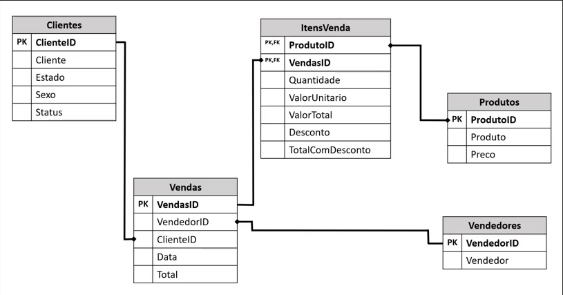
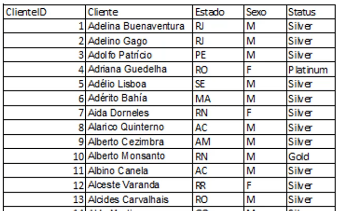
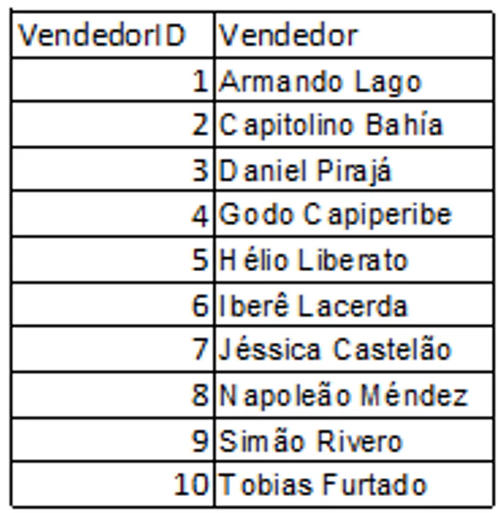
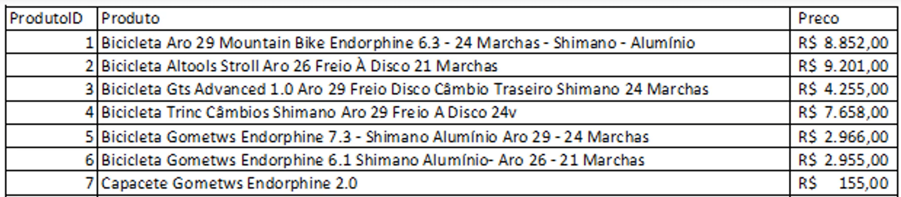
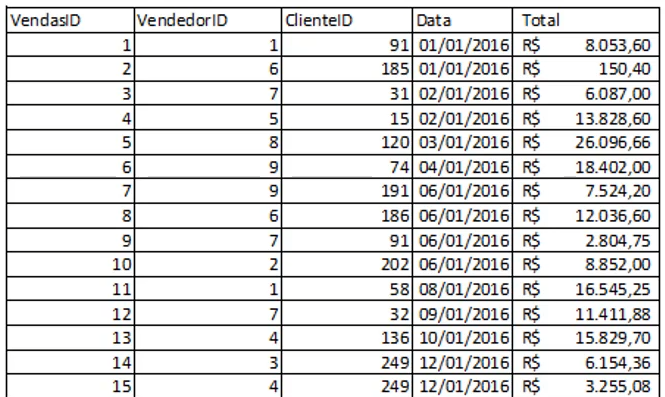
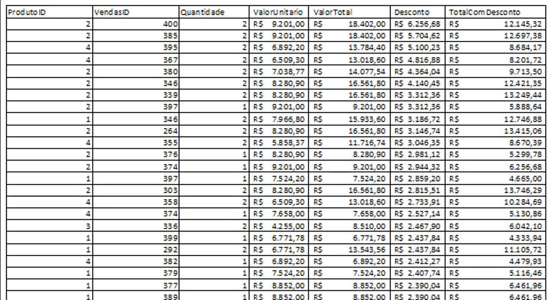

# Seção 3 - DataFrames e RDDs

## Atividades: Faça você mesmo

### Dados de Varejo - Empresa que vende produtos de ciclismo

Em dowload na VM, na pasta "Atividades" tem 5 arquivos formato parquet.

* Clientes.parquet
* ItensVendas.parquet
* Produtos.parquet
* Vendas.parquet
* Vendedores.parquet

 

 

Modelo relacional normalizado

 

#### Tabela Clientes

* Cada cliente com um idenficador único "ClienteID"
* 250 instâncias (250 clientes)
* 3 status: Silver, Gold e Platinum (Programa de fidelidade do cliente na empresa)

 

 

 

#### Tabela Vendedores

* 10 instâncias (10 vendedores)

 

 

 

#### Tabela Produtos

* 10 instâncias (10 produtos)

 

 

 

#### Tabela Vendas

* 400 instâncias (400 vendas)
  
 

 

 

#### Tabela ItensVenda

* 940 instâncias (940 itens)

 

 
  
 

### Atividade

 

1. Crie uma consulta que mostre, nesta ordem, Nome, Estado e Status
2. Crie uma consulta que mostre apenas os clientes do Status "platinum" e "gold"
3. Demonstre quanto cada status de clientes representa em vendas

**Resolva com DataFrames e faça joins se necessário**

 

Utilizar tabelas clientes e vendas para essa atividade
Formato parquet  - autoschema

1. Importar dados

tab_clientes = spark.read.format("parquet").load("/home/luciana/download/Atividades/Clientes.parquet")
tab_clientes.show(10)

        +---------+--------------------+------+------+--------+
        |ClienteID|             Cliente|Estado|Genero|  Status|
        +---------+--------------------+------+------+--------+
        |        1|Adelina Buenaventura|    RJ|     M|  Silver|
        |        2|        Adelino Gago|    RJ|     M|  Silver|
        |        3|     Adolfo Patrício|    PE|     M|  Silver|
        |        4|    Adriana Guedelha|    RO|     F|Platinum|
        |        5|       Adélio Lisboa|    SE|     M|  Silver|
        |        6|       Adérito Bahía|    MA|     M|  Silver|
        |        7|       Aida Dorneles|    RN|     F|  Silver|
        |        8|   Alarico Quinterno|    AC|     M|  Silver|
        |        9|    Alberto Cezimbra|    AM|     M|  Silver|
        |       10|    Alberto Monsanto|    RN|     M|    Gold|
        +---------+--------------------+------+------+--------+

tab_clientes.schema

        StructType([StructField('ClienteID', LongType(), True), StructField('Cliente', StringType(), True), StructField('Estado', StringType(), True), StructField('Genero', StringType(), True), StructField('Status', StringType(), True)])

tab_vendas = spark.read.format("parquet").load("/home/luciana/download/Atividades/Vendas.parquet")
tab_vendas.show(10)

        +--------+----------+---------+--------+--------+
        |VendasID|VendedorID|ClienteID|    Data|   Total|
        +--------+----------+---------+--------+--------+
        |       1|         1|       91|1/1/2019|  8053.6|
        |       2|         6|      185|1/1/2020|   150.4|
        |       3|         7|       31|2/1/2020|  6087.0|
        |       4|         5|       31|2/1/2019| 13828.6|
        |       5|         5|       31|3/1/2018|26096.66|
        |       6|         5|       31|4/1/2020| 18402.0|
        |       7|         5|       31|6/1/2019|  7524.2|
        |       8|         5|      186|6/1/2019| 12036.6|
        |       9|         7|       91|6/1/2020| 2804.75|
        |      10|         2|      202|6/1/2020|  8852.0|
        +--------+----------+---------+--------+--------+

tab_vendas.schema

        StructType([StructField('VendasID', LongType(), True), StructField('VendedorID', LongType(), True), StructField('ClienteID', LongType(), True), StructField('Data', StringType(), True), StructField('Total', DoubleType(), True)])

2. Criar consulta utilizando a tab_clientes com as seguintes colunas, em ordem: Nome, Estados e Status

consulta_clientes =  tab_clientes.select("Cliente","Estado","Status").withColumnRenamed("Cliente", "Nome")

consulta_clientes.show()

        +--------------------+------+--------+
        |                Nome|Estado|  Status|
        +--------------------+------+--------+
        |Adelina Buenaventura|    RJ|  Silver|
        |        Adelino Gago|    RJ|  Silver|
        |     Adolfo Patrício|    PE|  Silver|
        |    Adriana Guedelha|    RO|Platinum|
        |       Adélio Lisboa|    SE|  Silver|
        |       Adérito Bahía|    MA|  Silver|
        |       Aida Dorneles|    RN|  Silver|
        |   Alarico Quinterno|    AC|  Silver|
        |    Alberto Cezimbra|    AM|  Silver|
        |    Alberto Monsanto|    RN|    Gold|
        |       Albino Canela|    AC|  Silver|
        |     Alceste Varanda|    RR|  Silver|
        |  Alcides Carvalhais|    RO|  Silver|
        |        Aldo Martins|    GO|  Silver|
        |   Alexandra Tabares|    MG|  Silver|
        |      Alfredo Cotrim|    SC|  Silver|
        |     Almeno Figueira|    SC|  Silver|
        |      Alvito Peralta|    AM|  Silver|
        |     Amadeu Martinho|    RN|  Silver|
        |      Amélia Estévez|    PE|  Silver|
        +--------------------+------+--------+

 

**Solução do professor**

atividade1 = tab_clientes.select("Cliente","Estado","Status")

 

3.  Criar consulta filtrando apenas os clientes do Status "platinum" e "gold"

from pyspark.sql  import functions as Func

consulta_clientes_plat_gold = tab_clientes.filter((Func.col("Status") == "Platinum") | (Func.col("Status") == "Gold"))
consulta_clientes_plat_gold.show()

        +---------+-------------------+------+------+--------+
        |ClienteID|            Cliente|Estado|Genero|  Status|
        +---------+-------------------+------+------+--------+
        |        4|   Adriana Guedelha|    RO|     F|Platinum|
        |       10|   Alberto Monsanto|    RN|     M|    Gold|
        |       28|      Anna Carvajal|    RS|     F|    Gold|
        |       49|      Bento Quintão|    SP|     M|    Gold|
        |       68|      Carminda Dias|    AM|     F|    Gold|
        |       83|      Cláudio Jorge|    TO|     M|    Gold|
        |      121|    Dionísio Saltão|    PR|     M|    Gold|
        |      166|   Firmino Meireles|    AM|     M|    Gold|
        |      170|      Flor Vilanova|    CE|     M|Platinum|
        |      220|Honorina Villaverde|    PE|     F|    Gold|
        |      230|    Ibijara Botelho|    RR|     F|Platinum|
        |      237|  Iracema Rodríguez|    BA|     F|    Gold|
        |      247|         Joana Ataí|    GO|     F|Platinum|
        +---------+-------------------+------+------+--------+

 

**Solução do professor**

atividade2 = tab_clientes.select("*").where((Func.col("Status") == "Platinum") | (Func.col("Status") == "Gold"))
atividade2.show()

 

1. Group by por status  que representa em vendas?  Primeiro join com vendas
   1. Vendas join clientes where  vendas.ClientID = clientes.ClienteID, trazendo status
   2. Depois novo DF group by status

tab_vendas_status = tab_vendas.join(tab_clientes, tab_vendas.ClienteID == tab_clientes.ClienteID, "left").select(tab_vendas["*"], tab_clientes["Status"] )

tab_vendas_status.show(20)

    +--------+----------+---------+---------+--------+------+
    |VendasID|VendedorID|ClienteID|     Data|   Total|Status|
    +--------+----------+---------+---------+--------+------+
    |       1|         1|       91| 1/1/2019|  8053.6|Silver|
    |       2|         6|      185| 1/1/2020|   150.4|Silver|
    |       3|         7|       31| 2/1/2020|  6087.0|Silver|
    |       4|         5|       31| 2/1/2019| 13828.6|Silver|
    |       5|         5|       31| 3/1/2018|26096.66|Silver|
    |       6|         5|       31| 4/1/2020| 18402.0|Silver|
    |       7|         5|       31| 6/1/2019|  7524.2|Silver|
    |       8|         5|      186| 6/1/2019| 12036.6|Silver|
    |       9|         7|       91| 6/1/2020| 2804.75|Silver|
    |      10|         2|      202| 6/1/2020|  8852.0|Silver|
    |      11|         7|       58| 8/1/2019|16545.25|Silver|
    |      12|         7|       58| 9/1/2018|11411.88|Silver|
    |      13|         7|       58|10/1/2019| 15829.7|Silver|
    |      14|         3|      249|12/1/2020| 6154.36|Silver|
    |      15|         4|      249|12/1/2018| 3255.08|Silver|
    |      16|         7|      192|13/1/2020| 2901.25|Silver|
    |      17|         2|       79|13/1/2019| 15829.7|Silver|
    |      18|        10|       79|14/1/2019|16996.36|Silver|
    |      19|        10|      191|14/1/2019|   155.0|Silver|
    |      20|         9|      218|15/1/2018|  131.75|Silver|
    +--------+----------+---------+---------+--------+------+

tab_vendas_status.select("Status").groupBy("Status").count().show()

    +--------+-----+
    |  Status|count|
    +--------+-----+
    |Platinum|    2|
    |  Silver|  395|
    |    Gold|    3|
    +--------+-----+

tab_vendas_status.groupBy("Status").agg(sum("Total")).show()

    +--------+------------------+
    |  Status|        sum(Total)|
    +--------+------------------+
    |Platinum|          12584.68|
    |  Silver|        3014291.36|
    |    Gold|27286.690000000002|
    +--------+------------------+

tab_vendas.join(tab_clientes, tab_vendas.ClienteID == tab_clientes.ClienteID, "left").select(tab_vendas["*"], tab_clientes["Status"] ).groupBy("Status").agg(sum("Total")).show()

    +--------+------------------+
    |  Status|        sum(Total)|
    +--------+------------------+
    |Platinum|          12584.68|
    |  Silver|        3014291.36|
    |    Gold|27286.690000000002|
    +--------+------------------+

 

**Solução do professor**

from pyspark.sql.functions import sum as SUM

atividade3 = tab_vendas.join(tab_clientes, tab_vendas.ClienteID == tab_clientes.ClienteID).groupBy(tab_clientes.Status).agg(SUM("Total")).orderBy(Func.col("SUM(Total)").desc())

atividade3.show()

    +--------+------------------+
    |  Status|        sum(Total)|
    +--------+------------------+
    |  Silver|        3014291.36|
    |    Gold|27286.690000000002|
    |Platinum|          12584.68|
    +--------+------------------+

 

**teste null**

from pyspark.sql.functions import col

teste_null = tab_vendas.join(tab_clientes, tab_vendas.ClienteID == tab_clientes.ClienteID)
teste_null.show()
teste_null.filter(teste_null.Status.isNull()).show()

teste_null2 = tab_vendas.join(tab_clientes, tab_vendas.ClienteID == tab_clientes.ClienteID, "left")
teste_null2.show()
teste_null2.filter(teste_null2.Status.isNull()).show()